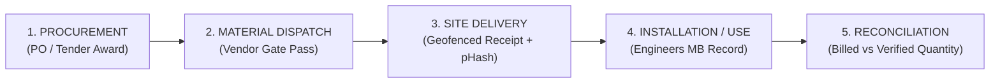

# Supply Chain Management Module Design Specification
**Anti-Fraud Material Custody & Quantity Reconciliation Layer for MPLADS Works**

---

## 1. Context & Core Problem Statement
In public works executed under the **MPLADS Guidelines (MoSPI)** and examined under statutory **Comptroller and Auditor General (CAG)** compliance audits, one of the most pervasive leakage vectors is the **Material Non-Delivery and Phantom Billing Pattern**:
1. **Over-Billing / Fictitious Invoicing**: Contractors submitting invoices for materials (e.g., 500 bags of OPC 43 Grade Cement, 12 MT TMT Steel Bars, 200m HDPE pipes) that were never procured or only procured in fraction.
2. **Diversion / Under-Installation**: Materials dispatched from vendors but diverted off-site before physical foundation or structural casting.
3. **Ghost Vendor Networks**: Billing through unregistered or shell material suppliers with unverified GSTINs.
4. **Duplicate Evidence Photos**: Reusing standard delivery stack photos across separate project sites or financial years.

The **MPLADS AI Supply Chain Management Module** solves this not by acting as a generic warehouse management tool, but as an **Anti-Fraud Traceable Chain of Custody and Reconciliation Engine** directly coupled to the AI Risk Intelligence Pipeline.

---

## 2. 5-Stage Traceable Chain of Custody

The module implements a strict 5-stage pipeline mirroring the platform's Statutory Stage-wise SLA Tracker:

### Stage Breakdown:
1. **`PROCUREMENT` (Tender / PO Issued)**:
   - Captures sanctioned Bill of Quantities (BOQ), material specification, authorized vendor ID, purchase order reference, and GeM/CPWD benchmark unit rate.
2. **`MATERIAL DISPATCH` (From Vendor)**:
   - Logs e-Way bill number, dispatch date, carrier details, vendor invoice number, and dispatched unit count.
3. **`SITE DELIVERY` (Received at Work Location)**:
   - On-site mobile receipt confirmation with GPS auto-capture, timestamp, delivery challan upload, and site photo analyzed via Perceptual Hashing (pHash) against the centralized evidence ledger.
4. **`INSTALLATION / USE` (Consumed into Physical Work)**:
   - Junior Engineer / Nodal Officer measurement book (MB) record logging verified quantity incorporated into structural physical assets.
5. **`RECONCILIATION` (Audit & Variance Analysis)**:
   - Automated formula comparing `Billed/Dispatched Quantity` against `Verified Installed Quantity`:
   $$\text{Variance \%} = \frac{\text{Delivered Qty} - \text{Verified Installed Qty}}{\text{Ordered Qty}} \times 100$$
   - Discrepancies exceeding the $\pm 10\%$ statutory tolerance trigger an automated `Rule SC-01` compliance violation and inject a point-weighted penalty into the Project Risk Score.

---

## 3. Data Provenance & Honesty Framework (DATA_STRATEGY.md Alignment)

In strict accordance with the project's **3-Tier Data Provenance Model**:

| Component / Stage | Data Tier | Real Data Source / Provenance Note |
| :--- | :---: | :--- |
| **Material Types & Categories** | **Tier 1** | Standard Schedule of Rates (CPWD DSR 2023 / State PWD) |
| **Vendor Registry & GSTIN** | **Tier 1/2** | Real vendor disbursements from MPLADS expenditure ledgers cross-verified with GSTN schema |
| **PO References & GeM Rates** | **Tier 2** | Calibrated against government GeM procurement price benchmarks |
| **Site Delivery Photos (pHash)** | **Tier 1** | Real on-device perceptual hash ledger with 64-bit Hamming distance matching |
| **Real-Time GPS En-Route Tracking** | **Tier 3 (Honest Flag)** | *Not simulated with fake telematics.* The platform explicitly models point-in-time custody handoffs (Dispatch $\to$ Delivery) rather than claiming non-existent live IoT truck tracking. |

---

## 4. Cross-System Architecture & Integration

1. **Vendor Registry Integration**:
   - Every supply record is keyed to verified `vendorId` in `MOCK_VENDORS` / backend SQLite user store.
2. **Duplicate Photo Detection (pHash)**:
   - Material stack delivery photos are hashed using `dHash / pHash (64-bit)` and checked against all historic delivery evidence to flag reused delivery photos.
3. **Risk Engine Point Contribution**:
   - Material quantity discrepancies ($>10\%$) inject $+22$ risk points into the Explainable Risk Score Breakdown under category `"Material Quantity Anomaly"`.
4. **Contractor Portal & Mobile Parity**:
   - Contractors and vendors monitor their delivery accuracy KPI, upload delivery proofs directly via mobile on-site camera, and receive instant reconciliation status reports.
