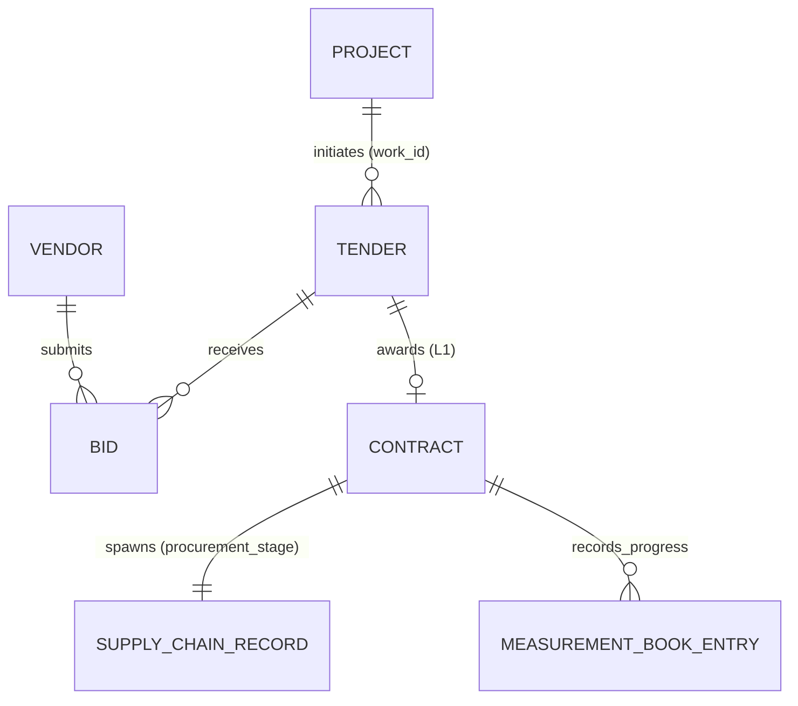

# E-Procurement, Tenders & Contract Registry Architecture

## 1. Statutory Alignment & Provenance Tiering
In accordance with the Central Government Public Procurement Framework (**General Financial Rules - GFR 2017**) and the project-wide **DATA_STRATEGY.md**, this module provides structured oversight over public bidding, bidder anomaly scrutiny, and contract execution.

### Provenance Classification
- **Tier 1 (Official Public Dataset)**: Member of Parliament sanctioned works, administrative approvals, and expenditure release figures.
- **Tier 3 (Demonstration / Illustrative Layer)**: Bid-level submission logs, comparative evaluation matrix, and bilateral contractor agreements.
- Every tender, bid, and contract record carries an explicit `data_provenance: "TIER_3_DEMO"` tag and displays the **"Illustrative Demo Data — Pending Direct e-Procurement Portal Integration"** badge.

---

## 2. Relational Entity Structure

### Entities
1. **Tender**:
   - `tender_id`, `work_id`, `work_title`, `category`, `tender_type` (`OPEN_TENDER` / `LIMITED_TENDER` / `NOMINATION` / `GEM_DIRECT`), `estimated_cost`, `publish_date`, `submission_deadline`, `status` (`DRAFT` / `PUBLISHED` / `BIDDING_OPEN` / `UNDER_EVALUATION` / `AWARDED` / `CANCELLED`), `district`, `state`.
2. **Bid**:
   - `bid_id`, `tender_id`, `vendor_id`, `vendor_name`, `bid_amount`, `technical_score`, `financial_rank` (`L1`..`Ln`), `variance_from_estimate_pct`, `is_suspiciously_low`.
3. **Contract**:
   - `contract_id`, `tender_id`, `work_id`, `vendor_id`, `vendor_name`, `contract_value`, `award_date`, `scheduled_completion_date`, `supply_chain_record_id`, `measurement_book_ref`.

---

## 3. Algorithmic Bidder Scrutiny Engine

The Bidder Scrutiny Engine runs 4 automatic anomaly detection rules:

1. **Abnormally Low Bid (`ABNORMALLY_LOW_BID`)**:
   - *Rule*: Flagged if qualifying L1 quote is $> 15\%$ below engineer estimate.
   - *Risk*: Threat of corner-cutting, substandard steel/cement, or contractor mid-work abandonment.
2. **Leaked Estimate Proximity (`LEAKED_ESTIMATE_PROXIMITY`)**:
   - *Rule*: Flagged if quote is within $\pm 0.25\%$ of confidential engineer estimate.
   - *Risk*: Advance leak of Schedule of Rates (SoR).
3. **Repeated Win Concentration (`REPEATED_WIN_CONCENTRATION`)**:
   - *Rule*: Flagged when the same vendor wins $\ge 2$ consecutive contracts in the same district.
   - *Risk*: Collusive regional monopoly / contractor cartelization.
4. **Collusive Bid Cluster (`COLLUSIVE_BIDDING`)**:
   - *Rule*: Flagged when $> 3$ bids are tightly bunched ($< 1.8\%$ spread) at a premium over estimate.
   - *Risk*: Bid rotation rings.

---

## 4. Downstream Lifecycle Integrations

- **Supply Chain Tracker**: Awarding a tender automatically instantiates a linked `SupplyChainRecord` with purchase order reference and material custody tracking.
- **Kanban Board**: Project execution cards automatically transition from *Sanctioned / To-Do* to *In Progress (Execution)* upon contract award.
- **Risk Intelligence**: Bidder anomalies feed directly into the Multi-Factor Risk Intelligence score for the corresponding project.
